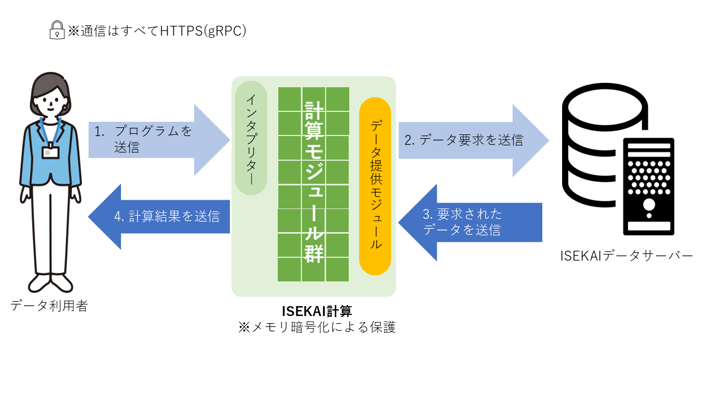

<h1 align="center">ISEKAI計算</h1>

- [概要](#概要)
- [QuickStart](#quickstart)
- [ISEKAIデータサーバー](#isekaiデータサーバー)
- [ISEKAIデータ提供モジュール](#isekaiデータ提供モジュール)
- [ISEKAI計算モジュール](#isekai計算モジュール)

# 概要
- このレポジトリでは、セーラ・ネットワークス株式会社（SEERA Networks Corporation）が提供する
セキュアな計算プラットフォームISEKAI計算を利用するための付属ソフトウェアを公開しています。

# QuickStart
- 最初に試す場合は[QuickStart](QuickStart.md)を読んでください。

# ISEKAIデータサーバー
- [ISEKAIデータサーバー](isekai-data-server)は、ISEKAI計算にデータを提供するためのサーバです。
NAT下のクライアント端末でも動かすことができます。

# ISEKAIデータ提供モジュール
- [ISEKAIデータ提供モジュール](mods/mod-http-data-flight)は、ISEKAI計算上で動作し、
ISEKAIデータサーバに接続してデータを取得するモジュールです。

# ISEKAI計算モジュール
- ISEKAI計算モジュールは、ISEKAI計算上で動作し、平均等の各種計算処理を実行するモジュールです。
- 現時点では公開しておりません。