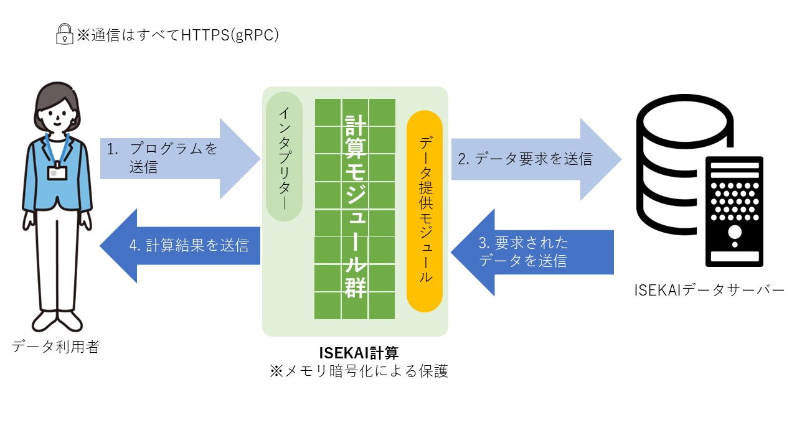

[English version is available here: README.en.md](README.en.md)

# ISEKAI計算（ISEKAI Compute）

**データを外に出さずに価値を生み出す。**

ISEKAI計算は、Trusted Execution Environment（TEE）上で動作するセキュアな計算プラットフォームです。  
データを外部に公開することなく、ポリシーに従った安全な処理を実行できます。

---

## 🚀 主な特徴

- 🔒 **データは所有者の元から外に出ない**
- 🧠 **TEE内でのみ計算を実行**
- 📜 **ポリシーによるデータ利用制御**
- 🔗 **データを共有せずに組織間連携**

---

## 🧩 背景（課題）

医療や金融などの分野では、次のような課題があります：

- 個人情報を含むデータを外部に出せない
- 高度な分析には大量のデータが必要
- 組織間のデータ共有には信頼の問題がある

👉 **「データを出さずに活用する」ことが求められています**

---

## 💡 解決アプローチ

ISEKAI計算は次のモデルを提供します：

> **データはその場に留まり、結果のみが共有される**

- 計算はTEE内でのみ実行
- 必要なデータを必要なタイミングで取得
- ポリシーにより処理内容を制御
- 元データは外部に一切公開されない

---

## 🏗 アーキテクチャ

### 🧩 モジュールモデル

ISEKAI計算では、データ提供モジュールおよび計算モジュールは
WebAssembly（WASM）で記述されます。

これにより：

- サンドボックス化された安全な実行
- 言語に依存しない拡張性
- TEE内での安全な動作

が実現されます。

主なモジュールには以下があります：

- データ提供モジュール（データ取得）
- 計算モジュール（仮名加工・集計など）

---

### 処理フロー

1. ユーザーが計算命令（DAG）を送信  
2. ISEKAI計算がデータサーバーにデータ要求  
3. データはTEE内でのみ利用  
4. ポリシーに従って処理を実行  
5. 結果のみユーザーに返却  

---

## 🧩 ユースケース：医療データの安全活用

### 課題

医療データ（カルテなど）は非常に機微性が高く：

- 病院から外部に持ち出すことができない
- 研究や創薬には大量データが必要
- 病院をまたぐ分析が困難

---

### 解決策

ISEKAI計算により：

- 病院がISEKAIデータサーバーを運用
- カルテデータは院外に出ない
- 計算はTEE内で実行
- 結果のみ研究者に提供

---

### 主なメリット

- 🔒 元データにアクセスできるのは病院のみ  
- 🚫 プラットフォーム運用者も閲覧不可  
- 🧪 安全な仮名加工を実現  
- 🔗 病院をまたぐデータ連携が可能  

---

### 高度な機能（Advanced Capability）

ISEKAI計算は複数の病院のデータベースに同時にアクセスし、  
それらを一体として処理することができます。

これにより：

- 病院横断のデータ分析が可能
- 同一人物の正確な識別が可能
- より高度な研究・創薬につながる

---

## 🔐 セキュリティモデル

ISEKAI計算はTEE（Trusted Execution Environment）を基盤としています：

- データと処理は管理者からも隔離
- メモリは暗号化され保護
- 検証されたコードのみ実行可能

さらに：

- データ利用はポリシーで厳格に制御
- 出力内容も制限可能（集計・仮名加工など）

---

## 📜 ポリシーモデル

各データにはポリシーが設定されます：

- 実行可能な処理
- 必須の加工処理（仮名化など）
- 出力制限

👉 **信頼ではなくポリシーでデータ利用を制御**

---

## 📄 背景と思想

医療や金融などの分野では、  
データの利活用とプライバシー保護の両立が重要な課題です。

ISEKAI計算は、「情報コントロール権」という考え方に基づき、  
データの所有者が利用方法を制御できる仕組みを実現します。

- 許可された処理のみ実行
- 利用範囲はポリシーで制御
- 元データは常に秘匿

---

## 概要
ISEKAI計算は、データ提供者が自身のデータの利用方法を制御する「ポリシー制御型データ処理」に関する研究に基づいています。このアーキテクチャでは、WebAssemblyによる柔軟な実行モデルとTEE（Trusted Execution Environment）による隔離実行環境を組み合わせることで、安全かつ制約されたデータ分析を実現します。データは直接共有されることはなく、データ提供者が定めたポリシーのもとでのみ計算が実行され、その結果のみが利用者に提供されるため、データの移動や集中管理を必要としない新しいデータ利活用モデルを実現します。

詳細は論文を参照してください。https://ieeexplore.ieee.org/document/11126844

---

## 🔧 はじめ方

### QuickStart
- 最初に試す場合は[QuickStart](QuickStart.md)を読んでください。

---

### ISEKAIデータサーバー
- [ISEKAIデータサーバー](isekai-data-server)は、ISEKAI計算にデータを提供するためのサーバです。
NAT下のクライアント端末でも動かすことができます。

---

### ISEKAIデータ提供モジュール
- [ISEKAIデータ提供モジュール](mods/mod-http-data-flight)は、ISEKAI計算上で動作し、
ISEKAIデータサーバに接続してデータを取得するモジュールです。

---

### ISEKAI計算モジュール
- ISEKAI計算モジュールは、ISEKAI計算上で動作し、平均等の各種計算処理を実行するモジュールです。
- 現時点では公開しておりません。